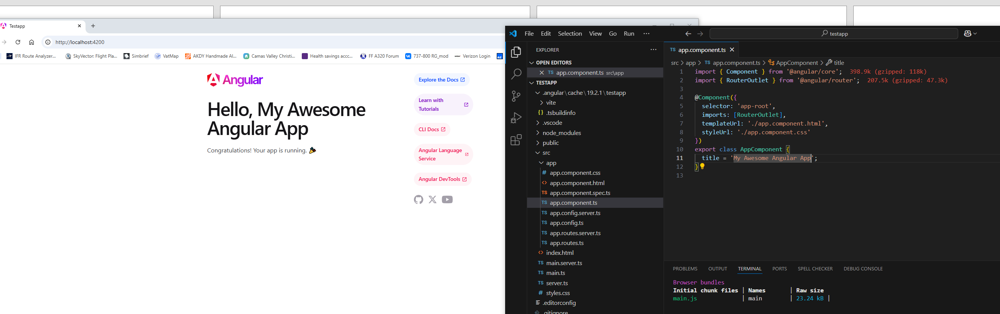
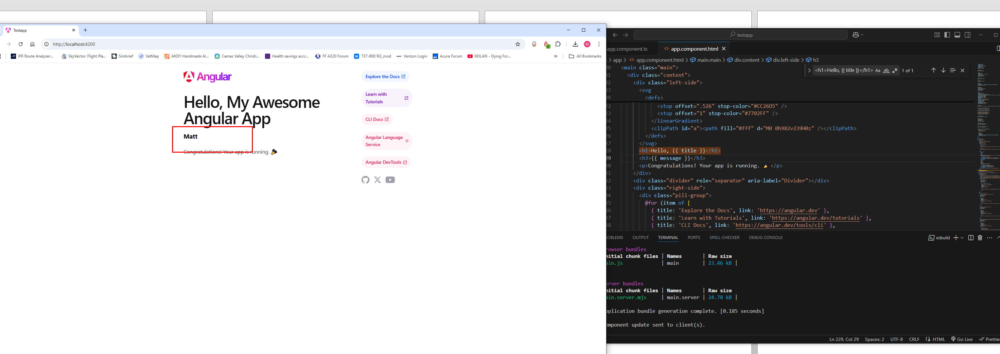

# CST-391 Activity 2: Angular Tools & First App

**Author: Matt Kollar**

## **Overview**
This activity involved setting up an Angular development environment, creating a new Angular project, modifying components, and understanding the structure of an Angular application. Below are the details of the steps taken, including descriptions of screenshots, modifications made, and research on the Angular project structure and page rendering process.

---

## **Screenshots and Descriptions**

### **1. Angular CLI Installation and Version Check**
- Screenshot showing the installation of Angular CLI (`npm install -g @angular/cli`).
- Verification of Angular version using `ng version`, ensuring the setup is correct.

### **2. Project Creation and Navigation**
- Screenshot displaying the command used to create the Angular project (`ng new testapp`).
- Navigation to the project directory (`cd testapp`).
- Running the application using `ng serve -o` to confirm that the project was generated successfully.

### **3. Modification of `app.component.ts`**
- **Title Change:** Updated the `title` variable in `app.component.ts`.
  
- **Added `message` Variable:** Included a new variable `message` containing my name, "Matt Kollar".
  

### **4. Modification of `app.component.html`**
- **Displaying `message` in UI:** Updated `app.component.html` to include `{{ message }}` inside an `<h3>` tag.
- Screenshot of the browser output confirming that the changes reflect in real-time due to Angular's auto-refresh feature.

---

## **Research Section**

### **1. Angular Project Structure**
Below is a breakdown of important files and folders within the Angular project:

| **Folder/File**      | **Purpose** |
|----------------------|------------|
| `node_modules/`      | Contains all installed npm dependencies. Do not edit manually. |
| `src/`               | The main source folder where the application code is stored. |
| `src/app/`           | Holds core Angular components, such as `app.component.ts`, services, and modules. |
| `src/assets/`        | Stores static assets (images, fonts, and other resources. |
| `src/environments/`  | Contains environment-specific configuration files (e.g., development vs. production). |
| `angular.json`       | Main configuration file for Angular CLI, defining project settings, styles, and scripts. |
| `package.json`       | Lists project dependencies, scripts, and package configurations. |
| `tsconfig.json`      | Configures TypeScript compiler options for the project. |

---

### **2. How Angular Generates the Page**
The process by which Angular compiles and renders a page involves several key files:

| **File**               | **Purpose** |
|------------------------|------------|
| `main.ts`             | Entry point for the application; bootstraps `app.module.ts`. |
| `app.module.ts`       | Declares Angular components and imports necessary modules. |
| `app.component.ts`    | Contains the main component logic (e.g., defining `title` and `message`). |
| `app.component.html`  | Defines the layout and structure of the UI using Angular's templating syntax. |
| `app.component.css`   | Styles specific to this component, allowing customization of appearance. |

### **Explanation of Rendering Process:**
1. `main.ts` initializes the Angular app and loads `app.module.ts`.
2. `app.module.ts` defines the components to be used in the application.
3. `app.component.ts` contains the logic and data, such as `title` and `message` variables.
4. `app.component.html` is responsible for rendering the data inside the browser.
5. The browser updates dynamically whenever changes are made, without requiring a full page reload.

---

## **Conclusion**
This activity covered the **installation, configuration, modification, and research** of an Angular application. Through modifying `app.component.ts` and `app.component.html`, we observed how Angular updates the UI dynamically. The research provided insights into the **project structure** and how **Angular processes and renders a page**. The screenshots serve as documentation of the completed tasks.

**Author:** Matt Kollar
